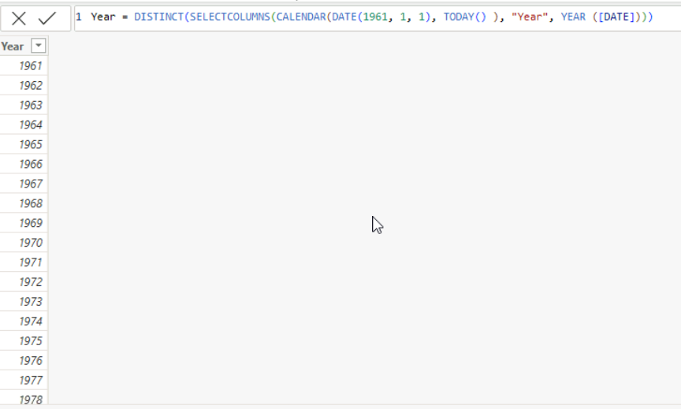
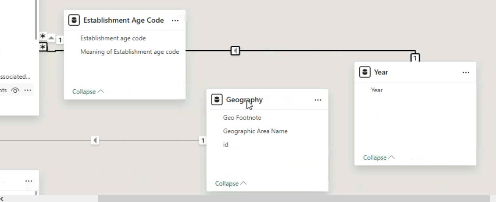

# 📈 Power BI - Business Establishments Analysis & Date Modeling

## 🎯 Project Overview
This project focuses on data modeling and architecture within Power BI, establishing dynamic date dimensions and evaluating historical business trends.

---

## 📐 Implementation & Data Architecture

### 1. DAX Calculated Dimension Table
A custom date dimension was created using DAX to establish a clean continuous year hierarchy:



```dax
Year = 
DISTINCT ( 
    SELECTCOLUMNS ( 
        CALENDAR ( DATE ( 1961, 1, 1 ), TODAY() ), 
        "Year", YEAR([Date]) 
    ) 
)


2. Relational Star Schema Model
An active Many-to-One (*:1) relationship was configured between the business establishment fact tables and the newly created Year dimension:


3. Dynamic Visual Results
Applying the custom year filter (1983) directly updates aggregate metrics across the model:

🛠️ Key Technical Skills Demonstrated
DAX Table Functions: CALENDAR, SELECTCOLUMNS, DISTINCT, TODAY.

Data Modeling: Relationship cardinality management (*:1) and Star Schema optimization.

Filter Context: Propagating filter context across dimension-fact tables in Power BI Desktop.


---

---

## 🚀 Part 2: Decade Granularity & Aggregations

### 1. Decade Calculated Column
Engineered a `Decade` column using DAX math functions (`MOD`) to group yearly data into 10-year intervals:


```dax
Decade = 'Year'[Year] - MOD('Year'[Year], 10)
